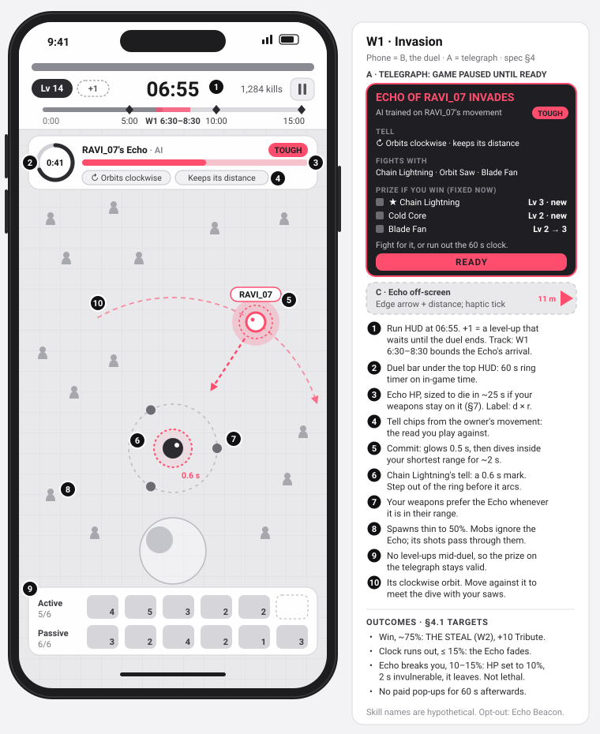
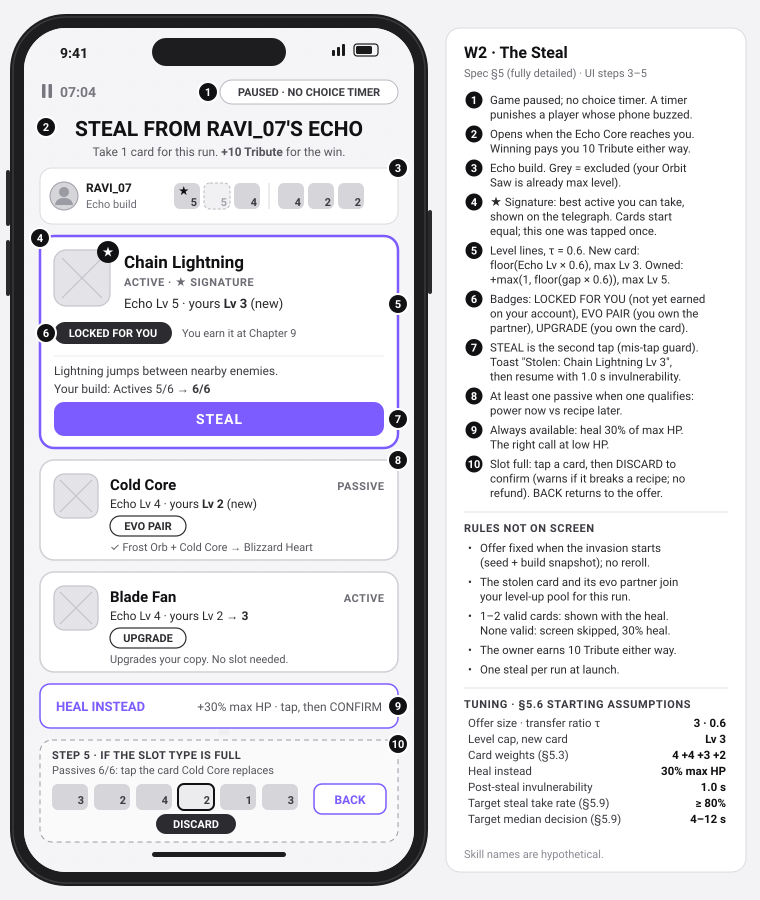
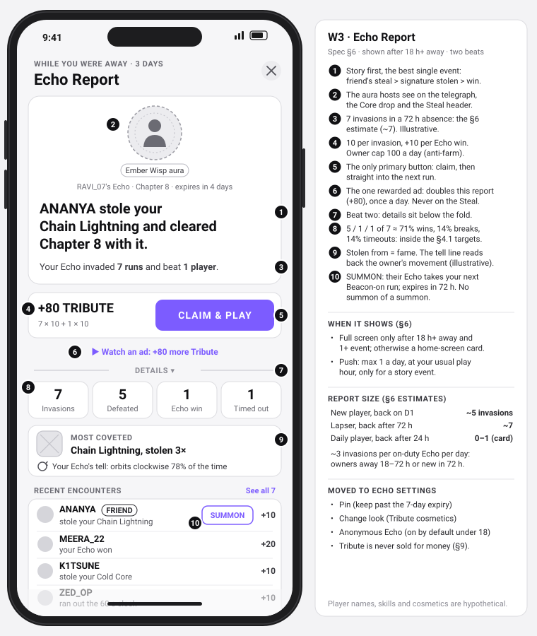

# ECHOES: Rival Invasions

**Q3 design spec** for a mobile survivor-like shaped like Survivor.io [S1][S3] (assumptions listed under Sources).

> **TL;DR**
> - **Feature:** your finished run becomes an **Echo**, an AI rival that moves like you and invades other players' runs. Beat it in a 60-second duel to **steal** an upgrade, sometimes one you haven't earned.
> - **Why:** another player inside a solo run, without real-time netcode, plus a return hook, the Echo Report.
> - **New:** Survivor.io's Showdown lets the *loser* of a live match take meta gear; ECHOES lets the *winner* take one in-run card from an async AI copy.
> - **Fully detailed section:** [§5 The Steal](#5-the-steal-fully-detailed-section).
> - **First test:** host win rate, Steal take rate, and whether friends spot a friend's Echo.
> - **Kill:** over 30% of D7-active players switch invasions off, or no D1 lift after two tuning passes.

I design systems that read players and let players read them back. Here the game reads how you move, sends it into someone else's run, and shows them the tell.

## 1. Rationale

**Player truth (hypothesis).** By minute 7 of a 15-minute run the build has mostly taken shape and the next boss is three minutes away. The thumb circles, hoovering gems. Nothing asks for a decision, and nobody else is in the run.

| Problem (hypothesis) | Evidence | Check |
|---|---|---|
| **Mid-run sag** between bosses | 15-minute chapters, 3 bosses [S1]; a 7:00 scripted wave [S2] may shorten the lull | Touches/s lower in 6:30–8:30 than 3:00–5:00; else move the window |
| **Builds converge** once recipes are known | Fixed evolution pairs (Lightning Emitter + Energy Cube = Supercell) [S3] | Distinct top-3 skill sets per 1,000 runs |
| **No other players** in chapter runs | Showdown is live, windowed, ticketed [S4]; co-op was local [S5] | Desire untested |

**Goals:** D1/D7 retention (primary KPI), social play without liquidity risk (a 2 a.m. player fights a 9 p.m. player), player-made content.

| Rejected | Why |
|---|---|
| Real-time 1v1 PvP | Showdown needed open hours, tickets and disconnect-equals-defeat [S4]; we'd arrive second |
| Online co-op | Vampire Survivors shipped it (Oct 2025) [S6]; needs friends online together |
| Async auto-battle arena | Archero 2 has one [S7]; spectating removes the only verb, moving |

## 2. Feature overview

**The rules in one sentence.** When your run ends your build becomes an Echo; Echoes invade other players' runs between bosses; beating one lets you steal one of its upgrades; your Echo keeps fighting while you're away and reports back. The **owner** made the Echo; the **host** is invaded.

**Prior art.** Closest: Phantom Abyss [S10], taking from async ghosts outside the genre. Nearest shipped mechanic: Showdown's Steal-on-Loss (v4.4.2, 18 Dec 2025 [S18]; launch rules [S4]; later changes unread [S19]):

| | Showdown Steal-on-Loss | ECHOES Steal |
|---|---|---|
| What moves | A meta loadout piece | One in-run card, gone when the run ends |
| Who steals | The loser (catch-up) | The winner (reward) |
| Where | Live 1v1 boss race, open hours | Normal PvE run, any time, offline |
| Opponent | A live human | An AI that moves like its owner |

**I found no shipped survivor-like (as of Sept 2026) where an AI copy of another player's build, moving like them, invades your PvE run mid-stage and can be beaten to take one of its in-run upgrades.** Medium confidence; SURVIVATON (2027) has 1–8 player point stealing [S20]. Survivor.io's Ender's Echo is a boss race [S21], so the fallback name is REVENANTS.

## 3. Echo creation (assumptions)

- **Eligible:** 5:00+ runs on open or linear stages ending with 2+ actives at Lv 2+, so throwaway runs can't flood the pool.
- **Snapshot** (about 2 KB): hero, skill levels, evolutions, damage shares, cosmetics, chapter, content version, movement traits (§8). One live Echo per owner per chapter band, replaced by the next eligible run and expiring after 7 days, unless pinned.
- **Upload checks** reject illegal builds and levels the run's length and chapter can't reach. Gear, talents and pets are display-only (§7).
- **Privacy:** Anonymous Echo defaults on for accounts under 18 or of unknown age (on my reading, India's DPDP Act 2023 requires verifiable parental consent for children's data; counsel to confirm). Only derived movement traits are stored, disclosed on first run.

## 4. Invasion flow

**When (assumptions).** One invasion per run, in W1 (6:30–8:30) of 15-minute open and linear stages (3 bosses [S1], assumed near 5:00, 10:00, 15:00), with no scripted wave or elite on screen; on linear stages it enters from the scroll edge, orbit trait off. None on 8-minute enclosed stages (5 bosses, no gap [S22]), if host HP stays under 50% through W1, on Steamroll, event or daily runs, or on a chapter failed twice (wall pushers may switch invasions off; if the prototype shows no difference, the rule goes).

**Telegraph.** The game pauses, as level-ups do, on a card: "ECHO OF RAVI_07 INVADES · AI trained on RAVI_07's movement", its tell ("Orbits clockwise, keeps its distance"), three skills, the three cards it offers (§5.3) and a label (Even, Tough, Deadly). It enters 2 s after READY (assumption) from an arrow-marked edge; Dark Souls gives AI invaders the same warning as human ones [S11]. Fight for the prize, or run out the clock.



### 4.1 The 60 seconds

Whether ECHOES is fun is decided here. Numbers are prototype assumptions.

| Rule | Why |
|---|---|
| Auto-targeting prefers the Echo in range | Else mobs soak every shot |
| Spawns thin to 50%; mobs and Echo ignore each other | It can't clear space or farm XP for you |
| Fires only its three banner skills, each mapped to one of 6 PvP patterns (projectile, orbit, zone, chain, beam, summon) with a 0.4–0.8 s tell; max 30 projectiles | Many PvE weapons hit instantly or home in; a duel must be dodgeable |
| Keeps its owner's range (max 40% of screen width) and orbit direction; every ~8 s glows 0.5 s, then dives inside your shortest weapon range for ~2 s | Orbit and aura builds need a window |
| XP banks; level-ups open after the duel | No mid-fight pause; the prize can't change |

**What wins is reading the orbit and meeting the dive.** My host runs Orbit Saw (short range) and Frost Orb; RAVI_07's Echo kites clockwise with Chain Lightning (skill names are hypothetical; Survivor.io's nearest is Lightning Emitter [S3]). When it glows, I move against its orbit so it dives into the saws; two or three dives kill it within the 25 s design time (§7). A projectile or chain Echo kites and chips; an orbit or aura Echo must close in and trade blows; r in §7 prices both.

| Outcome | Target | Result |
|---|---|---|
| Host wins | ~75% | The Steal (§5); host +10 Tribute |
| 60 s runs out | ≤ 15% | Echo fades; a legitimate escape, no penalty |
| Echo breaks the host | 10–15% | A would-be lethal hit leaves 10% of max HP and 2 s invulnerability; the Echo escapes with its cards. Mobs still kill |

Echo HP sets the timeout rate and Echo damage sets the break rate; host wins are the remainder.

**The Echo can't kill.** With lethal duels and 25% Echo wins, a player with three invaded runs a day would lose two or more to strangers on about 16% of days (binomial). No paid revive, energy or offer pop-up for 60 s after an Echo event.

**On by default.** A scripted dev-made Echo (d = 0.8) invades Chapter 1, so most new players meet the Steal in session one (assumption; §11 estimates about 80% on D0). The **Echo Beacon** toggle turns invasions off and stays set. Elden Ring makes invasions effectively opt-in [S23]; I start opt-out because the Steal is the reward.

## 5. THE STEAL (fully detailed section)

Numbers are starting assumptions (§5.6); skill names are hypothetical (§4.1). "Cards" on screen are "items" in code.

### 5.1 Player-facing rules

1. A beaten Echo drops an **Echo Core**, which homes in on you after 3 s. You are invulnerable from the frame the Echo dies until 1.0 s after the Steal closes.
2. The game pauses on up to **3 cards** from the Echo's build, fixed when the invasion began. Three is the genre norm [S24][S16]; Vampire Survivors offers 3 or 4 [S25].
3. Steal one, or **Heal instead** (30% of max HP, capped at full).
4. The stolen card joins your build and level-up pool for the rest of the run; an active also adds its evolution partner to the pool.
5. A new card needs a free slot of its type, or you discard one. Upgrading an owned card needs no slot.
6. Whether you steal or heal, you earn 10 Tribute, credited at once and kept if the run fails; the owner earns 10 for the invasion (§6).

### 5.2 UI flow



| Step | Screen | Input | Result |
|---|---|---|---|
| 1 | Echo HP hits 0: 0.5 s at 0.3× speed; Echo shatters, Core drops, mobs within 3 m pushed back | none | Clear ground around the Core |
| 2 | Core pulses; after 3 s it homes in at 2× your max speed | walk over it, or wait | Game pauses |
| 3 | "STEAL FROM RAVI_07'S ECHO"; its build strip, excluded cards grey; up to 3 equal cards (signature, passive, other), none selected; HEAL INSTEAD below | tap a card, or HEAL INSTEAD | Card enlarges with effect and build change; Heal asks CONFIRM, then step 6 |
| 4 | Enlarged card | tap STEAL | Owned item or free slot: step 6. Slot type full: step 5 |
| 5 | Slot picker: your cards of that type. Tapping one shows DISCARD, plus a recipe warning ("Discarding Frost Orb cancels Blizzard Heart") | DISCARD, or BACK | DISCARD: step 6. BACK: step 3 |
| 6 | Card flies into the build bar; toast "Stolen: Chain Lightning Lv 3" or "+30% HP" | none | Queued level-ups open, then the run resumes |

**Card text.** Badges: ★ SIGNATURE, LOCKED FOR YOU, EVO PAIR, UPGRADE. Levels read "Echo Lv 5 · yours Lv 3 (new)" or "Echo Lv 4 · yours Lv 2 → 3"; recipes read "[Active] + [Passive] → [Evolution]" with owned parts ticked. Android back does nothing in step 3 and acts as BACK in step 5.

**No timer:** level-ups already pause, and timers punish the player whose phone just buzzed. Two taps per choice guard against mis-taps (assumption).

### 5.3 Card generation

**The pool.** A host's level-up pool is every skill their account has earned plus their hero's exclusive (assumption: e.g. Chain Lightning is earned at Chapter 9). Other cards are **LOCKED FOR YOU**, supplied by owners further along and favoured by selection (§7): about 40–60% of offers in Chapters 1–10 carry one, near zero once all skills are earned (estimate). They are an early-game hook and a free trial of later chapters (hosts who stole one should attempt the next chapter sooner); veterans steal for levels and recipes.

**When.** Built once at invasion start from a host-build snapshot and the seed `hash(run_id, invasion_id)`, both saved with the run. Level-ups wait until after the duel, so the screen matches the banner's promise.

```text
function buildStealOffer(echo, snap, seed):        # snap = host build at invasion start
  rng = PCG32(seed); pool = []                     # integer weights and maths only
  for item in sortById(echo.inRunItems()):         # gear-granted weapons are not in-run items
    item = resolve(item, snap.hero)                # evolved -> base form, L_echo = 5;
                                                   # exclusive -> generic (unchanged if same hero,
                                                   # null if no generic); otherwise unchanged
    if item == null: continue
    if snap.level(item) == L_max or snap.hasEvolved(item): continue
    if pool.has(item.id): pool.keepHigherLevel(item); continue    # dedupe after resolve
    w = 4
    if item not in snap.pool:        w += 4        # LOCKED FOR YOU
    if snap.ownsEvoPartner(item):    w += 3        # EVO PAIR
    if snap.owns(item):              w += 2        # UPGRADE
    pool.add(item, w)

  offer = []
  sig = max(pool.actives, by = (echoLevel, damageShare, -id))
  if sig: offer.add(sig); pool.remove(sig)         # shown on the banner
  if pool.passives:
    p = weightedPick(pool.passives, rng); offer.add(p); pool.remove(p)
  while len(offer) < 3 and pool:
    c = weightedPick(pool, rng); offer.add(c); pool.remove(c)
  return offer                                     # 0 to 3 cards; 0 skips the screen
```

The signature is picked after exclusions, so the banner never promises an untakeable card.

### 5.4 Level transfer

```text
new item:    L_new = clamp( floor(L_echo × 60 / 100), 1, L_cap )                       # τ = 0.6
owned item:  L_new = min( L_max, L_host + max(1, floor((L_echo − L_host) × 60 / 100)) )
L_cap = 3, L_max = 5; an evolved Echo item counts as L_echo = 5
```

| Echo level | Host has | Result |
|---|---|---|
| 5 | nothing | Lv 3 |
| 4 | nothing | Lv 2 |
| 5 | Lv 2 | Lv 3 |
| 3 | Lv 4 | Lv 5 (minimum gain of 1) |

A fresh Lv 3 card equals three level-up picks: worth a 60 s duel and real risk, short of a phase of decisions. L_cap holds that line if τ rises. Stolen levels don't touch your XP bar or character level.

**Evolutions.** Level-ups raise a stolen active (at least two more picks from Lv 3, three from Lv 2). At Lv 5 with its partner passive it evolves from the next boss chest, the gate Survivor.io and Vampire Survivors use [S3][S26].

### 5.5 Edge cases

| Case | Rule | Why |
|---|---|---|
| Slot type full | Slot picker (step 5): any card of that type except the gear-granted starting weapon. The discarded card leaves your pool for the run, no refund | Hades Exchanges keep the old level [S17]; I don't, so the loss is weighed |
| Owned card | Offered as an upgrade; no slot; never two copies in one offer | One item, one slot |
| Host's copy maxed or evolved | Excluded; grey in the build strip | A dead card wastes a third of the offer |
| Echo's item evolved | Base form at L_echo = 5, recipe shown | Evolutions would skip the recipe loop |
| Hero-exclusive skill | Generic sibling; excluded if none; unchanged if the host plays that hero | Heroes are sold [S27] |
| Gear-granted weapon | Never offered | In-run cards only; Showdown moves meta gear [S4] |
| Passives | At least one in the offer when one qualifies | Power now vs recipe later |
| 1–2 cards qualify | Show them plus HEAL INSTEAD | No filler |
| None qualify | Screen skipped: 30% heal, toast "Nothing left to steal", `steal_skipped` logged | No screen with one real option |
| Level-up due in the duel or at pickup | Queued until after the Steal | One pause at a time; the offer stays valid |
| Same frame | Echo death resolves before timeout and host death | The host landed the kill |
| Host dies to mobs mid-duel | Duel ends as an Echo win | The owner's report stays true |
| App backgrounded | Run and duel timer pause (in-game time); same offer on return | The offer is in the run save |
| Force-quit or crash | State saved from the frame Echo HP hits 0; same offer on resume. If unrestorable (corrupt, or abandoned at the resume prompt), the Echo counts as beaten and no steal is granted | No reroll by restart |
| Offline | Two payloads prefetched at run start (W1, plus a spare if the first fails the content-version check), else a dev-made Echo. Steals from expired or pre-patch payloads stay valid; owner reports count uploads within 7 days | Nothing mid-run needs a connection |
| Anonymous or dev-made Echo | Header "STEAL FROM AN ECHO" or the archetype ("THE ORBITER"); dev Echoes pay no owner. Names truncate at 12 characters | No blank headers |
| Stealing from a friend | Same rules. The owner's report offers **Summon their Echo**: it replaces the invasion in the owner's next Beacon-on run, ignores the chapter filter, expires after 72 h. Hidden if the friend has no live Echo; no summon of a summon | Clash of Clans blocks revenge of a revenge [S15]; I read that as loop prevention |

### 5.6 Tuning table (starting assumptions)

| Parameter | Start | Test range | Moved by |
|---|---|---|---|
| Offer size | 3 | fixed | Genre norm |
| τ, transfer ratio | 0.6 | 0.4–0.8 | Take rate; clear-rate guardrail |
| L_cap for new cards; L_max | 3; 5 | 2–4; fixed | Take rate |
| Weights: base, locked, EVO pair, owned | 4, +4, +3, +2 | 0–8 each | Locked pick rate; signature share |
| Heal instead | 30% of max HP | 20–50% | Take rate when host HP < 30% |
| Core delay, homing speed | 3 s, 2× host | 1–5 s | Time from Echo death to pickup |
| Kill slow-mo; push-back radius | 0.5 s at 0.3×; 3 m | fixed; 2–5 m | Hits taken before pickup |
| Post-steal invulnerability | 1.0 s | 0.5–2 s | Hits in the first 2 s after resume |
| Host Tribute per Echo beaten | 10 | 5–20 | Tribute economy (§6) |
| Steals per run | 1 | fixed at launch | One trophy keeps it an event |

### 5.7 Anti-exploit rules

- **No reroll by restart:** seed and snapshot live in the run save.
- **Server recomputation:** the server rebuilds each offer from `steal_offer_shown` (seed, snapshot, config version) with the same PCG32 and integer weights. A mismatch voids that run's Echo rewards; three flag the account (assumption), so one bug can't punish an honest player.
- **Forged Echoes:** uploads are legality-checked (§3); a client-shipped signing key proves nothing. Downloads are server-signed (hosts can't edit their opponent) and version-filtered; banned accounts' Echoes are purged.
- **Client-trusted duels:** accepted, with small stakes: run-only steals, 10 Tribute, one invasion per run.
- **Feeding:** an (owner, host) pair pays once per rolling 24 h; owners cap at 100 Tribute a day. Alt farming is capped, not prevented; the 30% friend share and one Summon per friend per day bound friend-alt steering.
- **Trading:** impossible; steals never leave the run.

### 5.8 Telemetry

Every event carries `cell` and `config_version`.

| Event | Fields |
|---|---|
| `echo_invasion_start` | run_id, invasion_id, echo_id, owner_hash, is_friend, is_summon, is_dev_echo, chapter, attempt_no, run_time_s, host_hp_pct, host_dps, d, r, label, offer item_ids |
| `echo_invasion_end` | invasion_id, outcome (win / timeout / break / mob_death), duel_s, host_hp_lost_pct, commits_hit |
| `steal_offer_shown` | invasion_id, seed, host_snapshot, per card {item_id, position, level_offered, locked, evo_pair, owned, is_signature}, free slots by type, host_hp_pct |
| `steal_choice` | invasion_id, pick (position or heal), item_id, level_before, level_after, replaced_item_id, replaced_level, back_count, decision_ms (foreground ms, screen shown to final confirm), cards_inspected (distinct cards enlarged) |
| `steal_skipped`, `steal_interrupted` | invasion_id, reason; cause (background / quit / crash), restored |
| `run_end` (extended) | stolen_item_id, stolen_levels_gained_after, stolen_evolved, stolen_dps_share, result |

### 5.9 Success metrics

| Metric | Target (assumption, reason) | If missed |
|---|---|---|
| Steal take rate vs Heal | ≥ 80%; a steal should beat a heal unless HP is low | Raise L_cap to 4, then the locked weight |
| Locked pick rate beside earned cards | ≥ 55%; are locked cards why players fight? | Cut the locked weight; lean on EVO pairs |
| Signature share of steals | ≤ 60%; above that the choice is fake | Raise non-signature weights |
| Stolen card levelled again | ≥ 50%; it joined the build | Show the build change more clearly |
| Stolen actives that evolve | ≥ 20%; steals shape builds, not stats | Raise the EVO-pair weight |
| Median decision time | 4–12 s; faster is obvious, slower is confusing | Rewrite card text |
| Chapter clear rate, all B runs vs all A runs | −2 to +5 pp; steal runs alone are biased (those hosts already won a duel) | Above: lower τ. Below: lower Echo damage |

**Falsifiable line.** If locked cards drive the fight, hosts offered one run out the clock less often than hosts who aren't.

## 6. Echo Report & Tribute

**The report is small, so it leads with a story.** At 3 runs per DAU with half able to host (estimates: past 6:30, Beacon on, no wall or Steamroll), hosts supply about 1.5 × DAU invasions a day. An Echo is **on duty** while its owner has been away 18–72 h or the account is under 72 h old: about 0.5 × DAU Echoes if DAU/WAU ≈ 0.4, so about 3 invasions per on-duty Echo per day. Others are benched (fallback only): reports matter most to players about to return.

| Returning player | On duty | Invasions | Tribute |
|---|---|---|---|
| New, back on D1 after ~20 h | ~20 h at ×2 weight | ~5 | +60 (1 win) |
| Lapser, back after 72 h | 54 h | ~7 | +80 (1 win) |
| Daily, back after 24 h | 6 h | 0–1 | Home-screen card only |

The D1 hook is one named person taking your card ("MEERA_22 stole your Chain Lightning"). The headline is the best event: a friend's steal, then your signature stolen, then an Echo win. Full screen only after 18 h+ away with at least one event. Push: at most one a day, at your usual play hour, only for a story event, asked after your first Steal (Android 13+ needs a runtime prompt [S28]). If the D1 lift shows only for push-enabled players, the push is the feature.



Being beaten still pays the owner; being stolen from shows as fame ("Most coveted: Chain Lightning, 3×").

**Tribute** (Forza: "your Drivatar is earning you credits" [S12]; values assumed). Owners earn 10 per invasion, +10 per Echo win, capped at 100 a day; hosts earn 10 per Echo beaten. Sinks: Echo auras (first 140), pinning, one level-up reroll per run. A daily player earns about 20 a day (estimate: under 1 own-Echo invasion at 10, plus 1.5 hosted duels × 75% wins × 10): a week to the first aura. One rewarded ad a day doubles a report's Tribute, never on the Steal screen.

## 7. Echo selection & power normalisation

**Selection (assumptions).** Same stage type and content version, chapter ±2, under 7 days old, not the host's own or met in their last 10 invasions. ×2 weight for accounts under 72 h old and for Echoes carrying a skill locked for the host. Friends: max 30% of invasions. Benched Echoes only if nothing on duty passes the filters.

**Normalisation (constants and label thresholds are assumptions).** In-run strength counts, damped; the host's total power counts a little.

```text
DPS_x    := single-target DPS from a headless-sim table per skill and level (not observed damage)
r        := clamp( sqrt(inRunDPS_echo / inRunDPS_host), 0.7, 1.4 )   # meta stripped on both sides
TTK      := 25 s × d × r × (DPS_chapter / DPS_host)^0.2             # host's time to kill the Echo
HP_echo  := DPS_host × TTK
DPS_echo := r × maxHP_host / 20 s                                     # if every Echo hit landed
d        := clamp(1 + 0.8 × (w − 0.75), 0.8, 1.2)                    # w = host win rate, last 10 invasions,
                                                                      # timeouts = half a loss; 0.75 until 5
```

A host with twice the chapter's reference DPS kills an even Echo in 25 × 2^−0.2 ≈ 22 s. An Echo with twice the host's in-run DPS (r clamped to 1.4) takes 35 s and hits 1.4× harder.

**Trade-off.** Full normalisation erases your build in a genre about escalating power; none lets a whale's Echo crush a F2P host. I chose fairness with a visible slope: in-run build moves the duel −30% to +40% and gear about 13% per doubling of DPS; gear shows fully in the other 14 minutes, and Echo damage scales to the host's max HP, so spend can't crush anyone. Sim-table DPS stops sandbagging.

**Label:** Even, Tough or Deadly from d × r (under 0.95, 0.95–1.15, over 1.15). After about 50,000 duels (assumption), a win-probability model replaces d. Rejected: raw-power brackets, which split a thin pool by spend.

## 8. AI pilot: behaviour cloning, lite

The Echo runs **fitted steering** (seek, flee, orbit, avoid) on one of four dev-made archetypes (Orbiter, Kiter, Brawler, Collector), tuned by three owner traits: cheap, clampable, explainable. Rejected: input replay (can't react to a new horde) and a neural policy (costly on budget Android, opaque, copies exploits).

**Traits**, per crowd-density bucket (3 buckets, my analogue of Drivatar's per-segment model [S29]): **preferred range** (max 40% of screen width), **orbit direction**, **aggression** (retreat vs strafe when hit). Sampled at 5 Hz, uploaded as 9 numbers under 50 bytes; under 3 minutes of samples, the archetype plays unmodified. A leash keeps it within 1.2 screen widths; off-screen, an edge arrow tracks it (assumptions). Cost: about one elite enemy (estimate).

**Clamps (the Forza lesson).** Turn 10 removed player imitation from Forza Motorsport (2023) to "reduce aggressive driving behavior" [S13]. The Echo copies how you move, never what you exploit: stillness capped at 10%, at least 1.5 body widths from the host (assumptions), no contact damage, no heatmap-found safe corners, re-applied server-side. Labelled as AI on the banner, it never poses as a human.

**Read-back, tested first.** The host plays the tell; the owner reads it in the report. Before uploads are built, friends must pick their friend's Echo from three unlabelled ones above chance (33%), or archetypes ship alone.

## 9. Monetisation & growth

ECHOES is a retention feature: revenue is retention times existing monetisation; I forecast no direct ARPDAU lift.

- **Never sell power:** no paid steals, offer rerolls, invasion control or Tribute.
- **Cosmetics:** Echo auras show to hosts, but an Echo meets only about 3 busy hosts a day, so most views are the owner's report. Auras live in Tribute and a seasonal pass.
- **Growth:** a WhatsApp share ("My Echo is coming for you") deep-links an invite whose teaching invasion uses the inviter's Echo; weekly creator Echoes from Indian YouTubers; track K-factor.
- **Guardrails, B vs A:** ARPDAU, payer conversion, ad ARPDAU, clear rate on the three top-revenue wall chapters, since steals lower wall pressure and I assume spend concentrates there. Energy or revive spend within 10 min of an Echo event counts as harm.

## 10. Risks & mitigations

| Risk | Likelihood | Mitigation |
|---|---|---|
| Seen as a copy of Showdown or Ender's Echo | High | §2 differentiation; name REVENANTS |
| Invasions feel like interruptions | High | Telegraph choice, non-lethal breaks, timeout escape, Beacon, kill line (§11) |
| Imitation imports bad behaviour | Medium | Clamps (§8) |
| Steals cut wall revenue | Medium | Clear-rate guardrail (§9) |
| Thin reports or late-chapter pool | Medium | On-duty pool, wider chapter band, benched fallback, dev-made Echoes (§6, §7) |
| Offensive names; children's data | Medium | Name filter, reporting; Anonymous Echo default (§3) |
| WB's Nemesis patent US 10,926,179 B2 (2021) and continuations such as US 12,201,908 B2: "social vendetta" turns one player's defeat into an adversary others fight [S30][S31] | Unknown | Legal review before production; no non-infringement claim. Monolith closed in Feb 2025; WB still owns the patent [S32] |

## 11. Scope, test plan, KPIs & open questions

| Phase | Scope | Team, time (estimates) |
|---|---|---|
| Prototype, no backend | 20 dev-made Echoes, 4 archetypes, 6 attack patterns, duel, Steal, local telemetry, friend-ID test | 1 designer, 2 client engineers, 1 artist; 4–6 weeks |
| Soft-launch MVP | Player Echoes (traits if friend-ID passes), on-duty selection, normalisation, report and push, server checks, Tribute | + 1 server engineer, 1 QA; about 4 months |
| Later | Summons, Tribute pass, win-probability model, creator Echoes; a second window (11:30–13:30) and second steal, tested separately | Live ops |

About 25–35 person-months to MVP; server cost is a few reads and writes per run (estimates).

**Prototype measures** win, break and timeout rates; take rate; decision time; fight-vs-kite share; friend-ID (§8).

**Soft-launch A/B.** Only arm B creates and hosts Echoes, so the on-duty ratio matches a full rollout. +2 pp D1 on a 40% baseline (assumption) needs about 9,500 installs per arm (80% power, α = 0.05); with about 80% of B installs meeting an Echo on D0 (estimate), exposed players need about +2.5 pp.

| KPI | Target (assumption, reason) |
|---|---|
| D1, B vs A, split by push permission | +2 pp, the smallest lift that pays for the feature |
| D7, B vs A | ≥ +1 pp; the report must outlast novelty |
| Beacon off, share of D7-active B players | ≤ 15%; the on-duty model absorbs 15% fewer hosts, not 30% |
| Median events per report | ≥ 3; below that the report is a stub |
| Quit or idle rate between bosses 1 and 2 | −20% relative; tests the lull |

**Early warning:** fight share by nth invasion (novelty decay, answered with creator and seasonal Echoes).

**Kill** at the TL;DR thresholds. **Pivot:** if players love the Steal but hate invasions, an opt-in **Echo Gate** between bosses, modelled on Hades' Trial of the Gods [S33]: two Echoes show their signature cards; take one and the spurned Echo invades.

**Open questions.** Do hosts play the tell, or only the prize? Should Echoes prefer hosts on a different hero, to keep locked cards coming? Is one invasion per run enough once the on-duty pool is live?

## 12. How I curated AI output

The feature brief set the concept: the Echo, the Steal, the report, a Drivatar-style pilot, normalisation, invasion windows. Claude (via Claude Code) drafted the spec from it; AI reviewer passes attacked it as hiring manager, fact-checker, editor and genre designer, and the revisions answered them. Corrections ran both ways: a research pass found Showdown's Steal-on-Loss, which my concept missed, so the differentiation moved up, and review caught the draft flaws below.

**Before.** Claude's first saved draft of the Steal rules (excerpt, verbatim):

> 2. The game pauses and shows **3 cards** from the Echo's build. [...] 3. Steal one card, or take **Shards instead** (30 Echo Shards plus a 30% heal). 4. The stolen card is yours for the rest of this run.

**After (§5.1):**

| Draft rule | Now | Why |
|---|---|---|
| 2 | Offer fixed at invasion start; level-ups wait until after the duel | The draft never said when the offer was built; a promised card could vanish mid-duel |
| 3 | Heal instead (30% of max HP); 10 Tribute either way | Echo Shards were a currency nothing spent |
| 4 | Joins your level-up pool, with its evolution partner | Otherwise a locked steal could never reach Lv 5 or evolve; the 20% evolve target failed by construction |

**Also rejected:** invasions at 5:00 and 10:00 (the original brief; they land on boss beats), stealing evolved weapons outright, full-level transfer, a choice timer, and lethal invasions. Fact-check fixes are under Sources.

## Sources, assumptions & AI use

**AI use.** Drafted with Claude (Anthropic) via Claude Code, critiqued by AI reviewer passes (hiring-manager lens, fact-checker, domain expert, writing editor), revised, then condensed in a further Claude pass; §12 shows one before-and-after. A research pass fetched the pages below and a fact-checker pass re-read them against each claim. The final pass re-fetched the Phantom Abyss, Stay Safe, Vampire Survivors level-up and Android pages; Fandom wikis blocked automated fetches, so those rest on the earlier pass. * = content not readable. Arithmetic in §4, §6, §7 and §11 was re-checked. **Fact-check fixes:** Chain Lightning isn't a Survivor.io skill; Dark Souls player invasions are real-time, so the AI-invader precedent is its NPC invaders [S11]; Showdown's windows and tickets were there at launch; Hades Exchanges keep the boon's level. The DPDP reading (§3) needs counsel.

**Assumptions:** our game copies Survivor.io's shape (open, linear and enclosed stages; 6 active and 6 passive slots; 5 levels then EVO; paused level-ups; sellable heroes) [S1][S3] and gates generic skills by chapter. Every tuning number is mine; I copied no reroll count, as I couldn't verify Survivor.io's. Player-behaviour claims are hypotheses. [S8], [S9] and [S14] were consulted as lineage but aren't cited above.

- [S1] Survivor.io wiki, Chapters (open, linear and enclosed formats). https://survivorio.fandom.com/wiki/Category:Chapters
- [S2] Simple Game Guide, Chapter 2 walkthrough (low-tier, single chapter). https://simplegameguide.com/how-to-beat-chapter-2-survivor-io/
- [S3] Survivor.io wiki, Skills. https://survivorio.fandom.com/wiki/Skills
- [S4] Habby, official Survivor Showdown post (Dec 2025). https://www.facebook.com/SurvivorHabby/photos/-survivor-showdown-real-time-boss-race-progression-stealing-welcome-to-survivor-/865585822837787/
- [S5] Pocket Gamer, Survivor.io co-op (current availability unverified). https://www.pocketgamer.com/survivor-io/co-op/
- [S6] Wikipedia, Vampire Survivors. https://en.wikipedia.org/wiki/Vampire_Survivors
- [S7] Theria Games, Archero 2 Arena guide. https://theriagames.com/guide/archero-2-arena-guide/
- [S8] NetHack wiki, Bones. https://nethackwiki.com/wiki/Bones
- [S9] Stay Safe (itch.io). https://lancelol.itch.io/stay-safe
- [S10] Phantom Abyss, Steam store page. https://store.steampowered.com/app/989440/Phantom_Abyss/
- [S11] Dark Souls wiki, Invaders. https://darksouls.fandom.com/wiki/Invaders
- [S12] Xbox Wire, Forza Horizon 2 Drivatars (2014). https://news.xbox.com/en-us/2014/09/30/games-forza-horizon-2-drivatars/
- [S13] Turn 10, Forza Motorsport Drivatars (Jul 2023). https://forza.net/news/forza-motorsport-drivatars-tire-physics
- [S14] Supercell, Clash of Clans release notes (6 Oct 2025). https://supercell.com/en/games/clashofclans/blog/release-notes/get-ready-for-ranked-update/
- [S15] Clash of Clans wiki, Multiplayer Battles (no revenge of a revenge). https://clashofclans.fandom.com/wiki/Multiplayer_Battles
- [S16] Wikipedia, Hades. https://en.wikipedia.org/wiki/Hades_(video_game)
- [S17] Hades wiki, Boons (Exchanges). https://hades.fandom.com/wiki/Boons
- [S18] Survivor.io, App Store listing and version history. https://apps.apple.com/us/app/survivor-io/id1528941310
- [S19]* Habby, "Survivor Showdown: New Season Update & Rule Adjustments". https://www.facebook.com/SurvivorHabby/posts/-survivor-showdown-new-season-update-rule-adjustments-greetings-survivorssurvivo/879393834790319/
- [S20] JUJUTSU KAISEN RUMBLE: SURVIVATON, official site. https://jjkrsurvivaton.shueisha-games.com/en/
- [S21] Survivor.io wiki, Ender's Echo. https://survivorio.fandom.com/wiki/Ender's_Echo
- [S22] Survivor.io wiki, Chapter 3 (8-min enclosed map). https://survivorio.fandom.com/wiki/Chapter_3_-_Basement_Parking
- [S23] Elden Ring wiki, Taunter's Tongue. https://eldenring.wiki.gg/wiki/Taunter's_Tongue
- [S24] PocketGamer.biz / AppQuantum, Survivor.io core loop (Sep 2022). https://www.pocketgamer.biz/how-innovation-and-iteration-has-transformed-survivorio/
- [S25] Vampire Survivors wiki, Level up. https://vampire.survivors.wiki/w/Level_up
- [S26] Vampire Survivors wiki, Evolution. https://vampire.survivors.wiki/w/Evolution
- [S27] Survivor.io wiki, Characters (Survivors cost shards or real money). https://survivorio.fandom.com/wiki/Characters
- [S28] Android Developers, Notification runtime permission (Android 13). https://developer.android.com/develop/ui/views/notifications/notification-permission
- [S29] Game Developer, How Forza's Drivatar actually works (Jun 2021). https://www.gamedeveloper.com/design/how-forza-s-drivatar-actually-works
- [S30] Google Patents, US 10,926,179 B2. https://patents.google.com/patent/US10926179B2/en
- [S31] Google Patents, US 12,201,908 B2. https://patents.google.com/patent/US12201908B2/en
- [S32] Gematsu, Monolith closure (Feb 2025). https://www.gematsu.com/2025/02/warner-bros-games-cancels-wonder-woman-shuts-down-monolith-productions-player-first-games-and-warner-bros-games-san-diego
- [S33] Hades wiki, Trial of the Gods. https://hades.fandom.com/wiki/Trial_of_the_Gods
